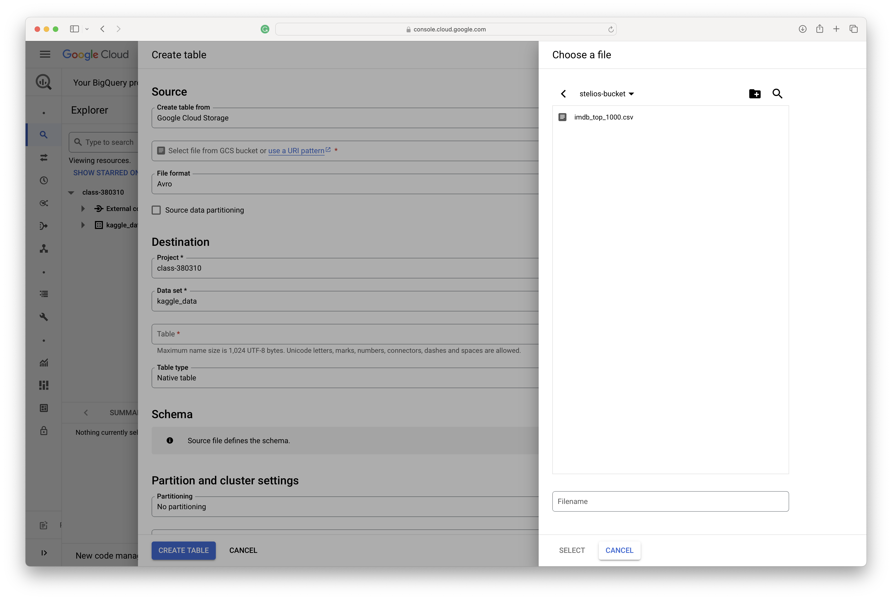
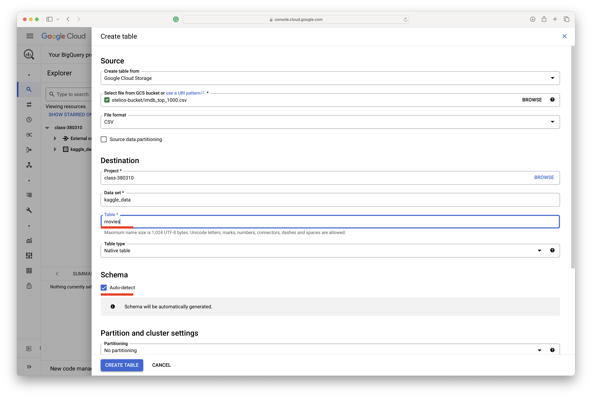
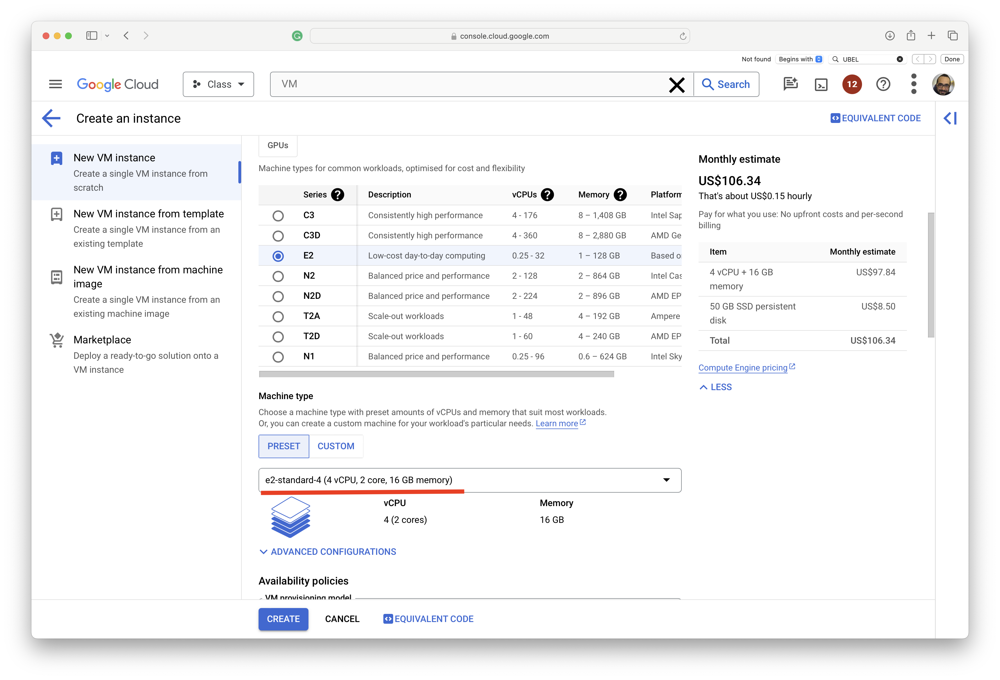

## Part 1: Create a Virtual Machine (VM)

* Follow the instructions to create a VM.


* Add a name.


* Set your boot disk.


* Complete your VM details.

> In this example we will use an `Ubuntu 20.04 LTS` server.


* Allow `HTTP` and `HTTPS` traffic.


### Install Jupyter Notebook on GCP.

Ensure you have Python installed on your machine. Jupyter Notebook supports Python 3.3 or later. You can install Python 3 by executing:

```bash
sudo apt-get update -y && sudo apt-get upgrade -y
```

### Step 1: Install pip

`pip` is a package manager for Python. It's used to install and manage Python libraries. Execute the following command to install pip for Python 3:

```
sudo apt install python3 python3-pip -y
```

### Step 2: Upgrade pip (Optional)

It’s a good practice to have the latest version of pip. Upgrade pip using the following command:

```
pip install --upgrade pip
```

### Step 3: Install Jupyter Notebook

Now, install Jupyter Notebook using pip:

```
pip3 install jupyter
```

>  **Close your SSH windows, and start again.**

### Step 4: Start and Access Jupyter Notebook

Launch Jupyter Notebook by executing the following command:

```
jupyter notebook --ip='*' --NotebookApp.token='' --NotebookApp.password=''
```

Or

```
~/.local/bin/jupyter-notebook --ip='*' --NotebookApp.token='' --NotebookApp.password=''
```

If you like you can setup a token or password:

```
~/.local/bin/jupyter-notebook --ip='*' --NotebookApp.token='supersecret1234' --NotebookApp.password=''
```

On GCP, open port `8888` or allow access to all.

* Click on `default`


* Acces the firewall


* Add a new rule.


* Create the rule and save it.


* Return to your VM instances.


* Open your web browser and type the following URL:


```
http://{your-ip}:8888/
```

## Part 2: Create a bucket

* Follow the instructions to create a Bucket.
* First, navigate to the Bucket space.


* Then create a new Bucket.


* Then, add a new Bucket name.


* Click the confirm button.


* Load a dataset from Kaggle (IMDB Movies Dataset).

> https://www.kaggle.com/datasets/harshitshankhdhar/imdb-dataset-of-top-1000-movies-and-tv-shows?resource=download


* Upload the dataset.


## Part 3: Create a new dataset on BigQuery

* Navigate to the BigQuery interface.


* Create a new dataset


* Let's call it `kaggle_data`.


* Create a new table.


* Set the sourceto the `Google Cloud Storage`.


* Then, select your dataset from your Bucket.



* Finally, set your table name  to `movies` and the schema to `auto-detect`.



* Let's run some simple queries - Click on your dataset and `QUERY` option in a new tab.


* Run a simple query.

  > Do not forget to add a star(*) after the `SELECT` statement.

  ```
  SELECT * FROM `class-380310.kaggle_data.movies` LIMIT 10;
  ```


* Explore queries using SQL-like statements.

```sql
SELECT * FROM `class-380310.kaggle_data.movies` 
WHERE Series_Title Like "%Lord%";
```


## Part 4: Access the data from Python

* Create a new IAM policy for BigQuery


* Access the service accounts.


* Create a new service account.


* Complete the service account details.

  > Complete a name and a description.


* Navigate back to IAM and create the new principals.


* Add the new role.

> Type `BigQuery` and select `Admin`.


* The new role should be dispalyed in your list.


* Let's create a new key to access the BigQuery dataset from outside. Go to Service accounts and select `Manage keys`.


* Add a new key.


* Download the JSON file into your local folder.


* Create a new Python script (I am using colab).

> https://colab.research.google.com/drive/1br-6wQoanZGz_Zg0jayCOZI9_zthP3S9?usp=sharing

```
!pip install google-cloud-bigquery

from google.cloud import bigquery
from google.oauth2 import service_account

credentialsPath = r'class-380310-6fb7133281e5.json'

credentials = service_account.Credentials.from_service_account_file(credentialsPath)

client = bigquery.Client(credentials=credentials)

query = 'CALL class-380310.kaggle_data.movies'

results = client.query(query)

print(results)

query = client.query("""
  SELECT * FROM `class-380310.kaggle_data.movies` LIMIT 10
 """)

results = query.result()
for row in results:
	print(row)
```

> Make sure you upload your key - or have your key in the same directory with your scirpts (if you run it locally)!

* FInally run your Python scripts!


> **Now delete everything you done!**

* Navigate to Buckets and delete the Bucket.
* Navigate to BigQuery and delete your dataset.
* Navigate to the IAM and delete your principal (use the pen to edit the principal and delete the role).
* Navigate to the IAM *→* Service accounts and delete your BigQuery service account.

## Part 5: Access the data from Python

* Create a new VM with more resources.



* Change the boot disk to `Ubuntu 24.04 LTS`
  * 


> Connect to the VM using SSH

1. Update your VM.

```
sudo apt-get update
```

2. Install python.

```
sudo apt-get install python3-pip -y
```

3. Download Ollama.

```
curl -fsSL https://ollama.com/install.sh | sh
```

4. Download and run the model.

```
ollama run llama2
```

* Ask a question!

> How many Oscars has Sir Ian McKellen won?

You can exit using:

```shell
/bye
```

5. Create a Modelfile, for example using `pico`.

Run the following command.

```
pico Modelfile
```

6. Then enter the following text.

```
FROM llama2

# set the temperature to 1 [higher is more creative, lower is more coherent]
PARAMETER temperature 1

# set the system message
SYSTEM """
You are Mario from Super Mario Bros. Answer as Mario, the assistant, only.
"""
```

> * Press together `control` and `S` to save.
>
> * Then, `control` and `X` to exit.

7. Next, create and run the model:

```
ollama create mario -f ./Modelfile
```

* Then run the next command.

```
ollama run mario
```

* Now discuss with Mario!

> Hi there!
>
> You should reveive a response from Mario.

> Press `Control` and `C` to break the chat at any time.

8. Install Ollama library

```
pip install ollama
```

9. Create a new Python script using pico.

```
pico test.py
```

10. Paste the following code, and then run your code!

```
import ollama

stream = ollama.chat(
    model='llama2',
    messages=[{'role': 'user', 'content': 'Who is Bowser? Show me only 2-3 lines'}],
    stream=True,
)

for chunk in stream:
  print(chunk['message']['content'], end='', flush=True)
```

* Or you can get a response from Mario, adjust your code to the `mario` model!

```
import ollama

stream = ollama.chat(
    model='mario',
    messages=[{'role': 'user', 'content': 'Who is Bowser? Show me only 2-3 lines'}],
    stream=True,
)

for chunk in stream:
  print(chunk['message']['content'], end='', flush=True)
```

11. Run your script!

```
python3 test.py
```

Optional material to setup a UI:

Install Docker

```apt  install docker
apt install docker.io
```

Install the web-ui docker container.

```
docker run -d --network=host -v open-webui:/app/backend/data -e OLLAMA_BASE_URL=http://127.0.0.1:11434 --name open-webui --restart always ghcr.io/open-webui/open-webui:main
```

Go to VM at port 3000

```
import ollama

stream = ollama.chat(
    model='llama2',
    messages=[{'role': 'user', 'content': 'Why is the sky blue?'}],
    stream=True,
)

for chunk in stream:
  print(chunk['message']['content'], end='', flush=True)
```


